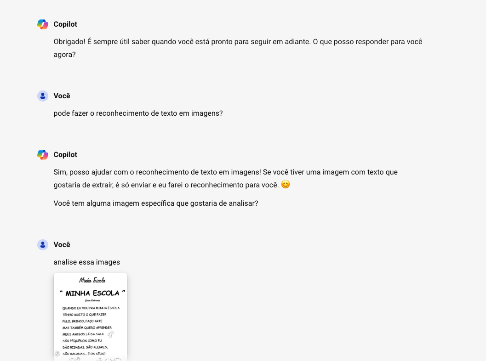

# EXERCÍCIO DE RECONHECIMENTO E GERAÇÃO MICROSOFT COPILOT
Esse repositório de exercício tem como exemplos interpretações do Microsoft Copilot reconhecendo caracteres em imagens e analisando seu conteúdo.
## ANÁLISE DE IMAGENS
Foi pedido que a inteligência analisasse imagens e realizasse o reconhcecimento dos caracteres. Os prints mostram como foram realizados os comandos.

### 1ª IMAGEM - POEMA INFANTIL
Comando para análise

Análise do reconhecimento dos caracteres na imagem

### 2ª IMAGEM - FUTEBOL
Comando para análise

Análise do reconhecimento dos caracteres na imagem

Nesta imagem foi pedido uma análise mais detalhada do conteúdo, já que a análise incicial foi muito superficial.

### 3ª IMAGEM - VISÃO COMPUTACIONAL
Comando para análise

Análise do reconhecimento dos caracteres na imagem

## GERAÇÃO DE IMAGENS
Como exercício também foi pedido que a Plataforma Microsoft Copilot gerasse imagens seguindo os comandos para aplicaçnao de diferentes estilos.

### 12 TRABALHOS DE HÉRCULES
Comando para geraçNao de imagens seguindo o estilo desejado

Foi pedido também para a IA que gerasse análise referente ao pedido da imagem gerada, explicando um pouco sobre o tema proposto.

### RAMSES
Comando para geraçNao de imagens seguindo o estilo desejado

Foi pedido também para a IA que gerasse análise referente ao pedido da imagem gerada, explicando um pouco sobre o tema proposto.

### HELENA DE TROIA
Comando para geraçNao de imagens seguindo o estilo desejado

Foi pedido também para a IA que gerasse análise referente ao pedido da imagem gerada, explicando um pouco sobre o tema proposto.

### JESUS
Comando para geraçNao de imagens seguindo o estilo desejado

Foi pedido também para a IA que gerasse análise referente ao pedido da imagem gerada, explicando um pouco sobre o tema proposto.

### INTELIGÊNCIA ARTIFICIAL NO COTIDIANO
Comando para geraçNao de imagens seguindo o estilo desejado

Foi pedido também para a IA que gerasse análise referente ao pedido da imagem gerada, explicando um pouco sobre o tema proposto.

A ferramenta se comportou muito bem nas respostas aos comandos, assim é uma excelente opção para utilização na resolução de demandas que necessitem da solução.
